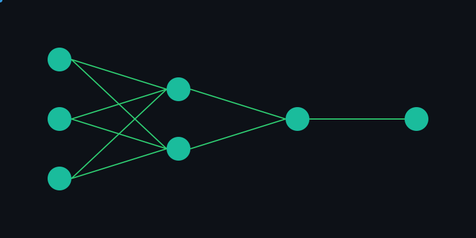

<h1 align="center">Hi 👋, I'm Jeremy Panggabean</h1>
<h3 align="center">Currently studying about python and machine learning 🤖🐍 </h3>

  

### 🚀 About Me

- 🤺 I'm passionately diving into the world of **machine learning engineering**, constantly learning and evolving my skills.
- 👀 I’m eager to collaborate on **groundbreaking projects** that push the boundaries of technology and creativity.
- ⚽ I'm like **Football Sport (Culés)**.

<!-- Save the SVG content above as ml-animation.svg in your repository -->

  

  <h2 style="color: #6C63FF;">📫 Connect with Me</h2>
  
  

### 🛠️ Languages and Tools

### 📊 GitHub Stats

  

### 📈 Contribution Graph

  

### 🔝 Most Used Languages

  

### 🏆 GitHub Trophies

  

---

  

